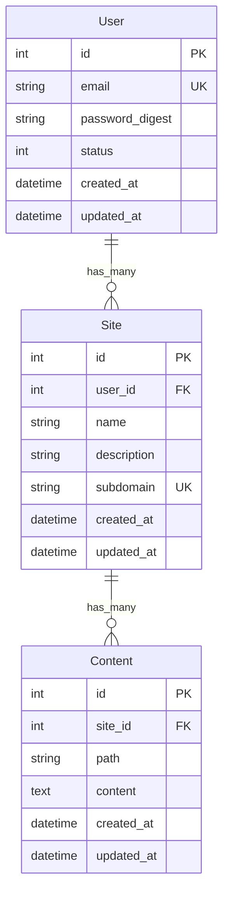

# データモデル設計

## モデル定義

### User

| カラム名        | 型       | 制約                | 説明                       |
| --------------- | -------- | ------------------- | -------------------------- |
| id              | integer  | PK                  | ID                         |
| email           | string   | UNIQUE, NOT NULL    | メールアドレス             |
| password_digest | string   | NOT NULL            | パスワード                 |
| status          | integer  | NOTNULL, default: 0 | 権限(0: general, 1: admin) |
| created_at      | datetime |                     | 作成日時                   |
| updated_at      | datetime |                     |                            |

### Site

| カラム名    | 型      | 制約 | 説明         |
| ----------- | ------- | ---- | ------------ |
| id          | integer | PK   | ID           |
| user_id     | integer | FK   | ユーザー ID  |
| name        | string  |      | サイト名     |
| description | string  |      | サイトの説明 |
| subdomain   | string  |      | サブドメイン |

### Content

| カラム名 | 型      | 制約 | 説明           |
| -------- | ------- | ---- | -------------- |
| id       | integer | PK   | ID             |
| site_id  | integer | FK   | サイト ID      |
| path     | string  |      | ファイル名     |
| content  | text    |      | ファイルの中身 |

## ER 図

