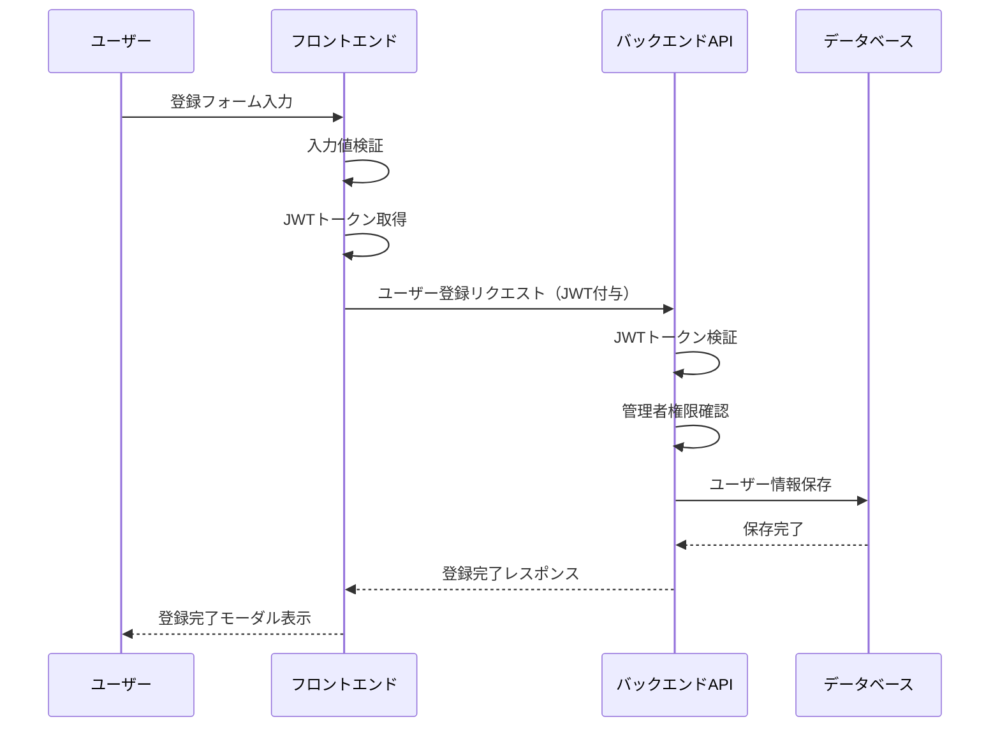
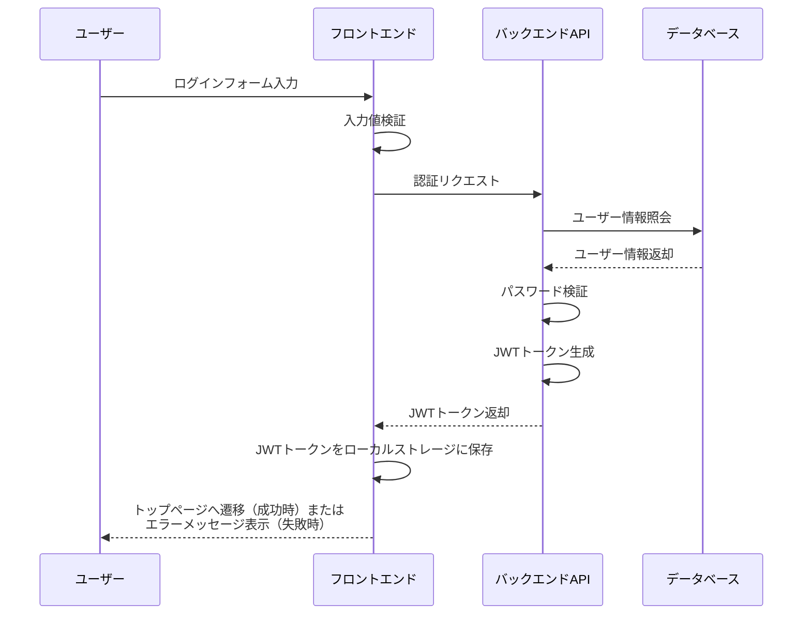
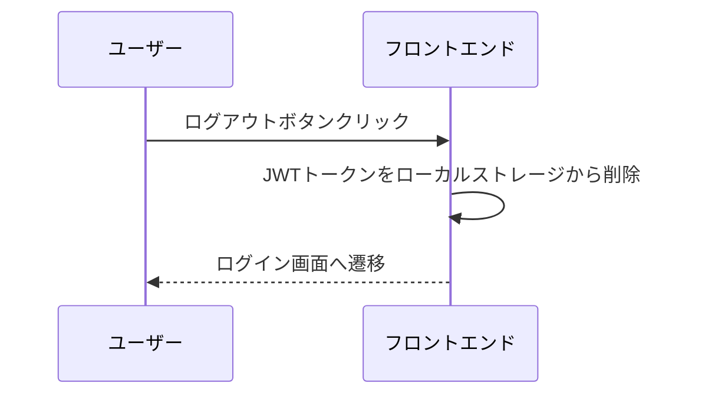
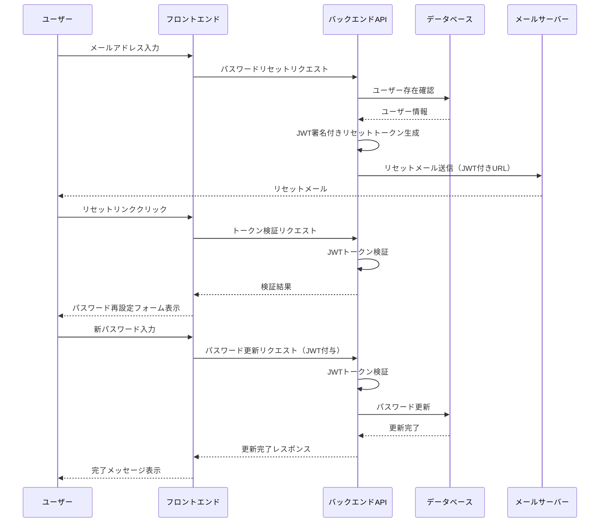
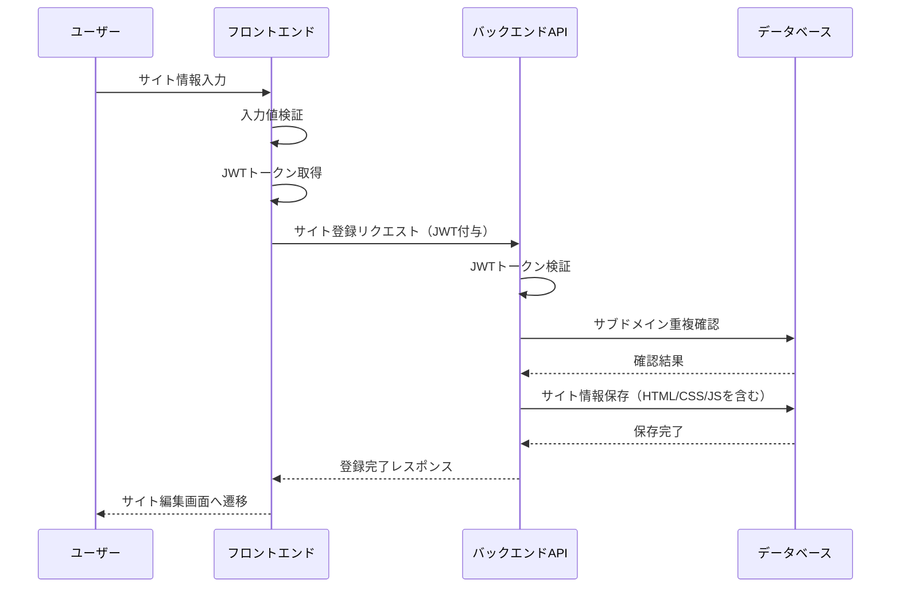
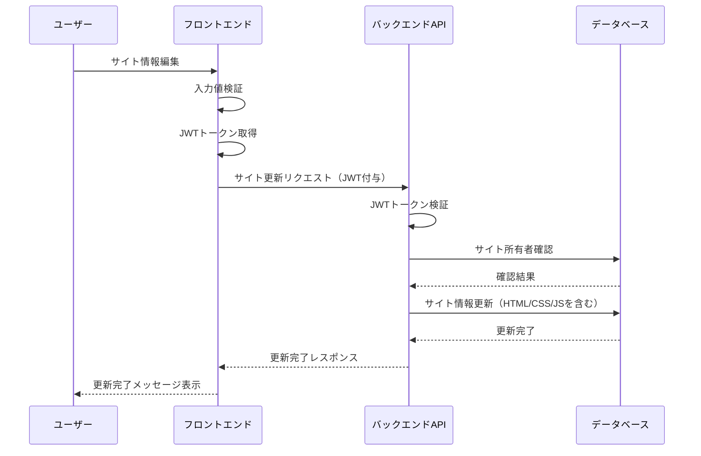
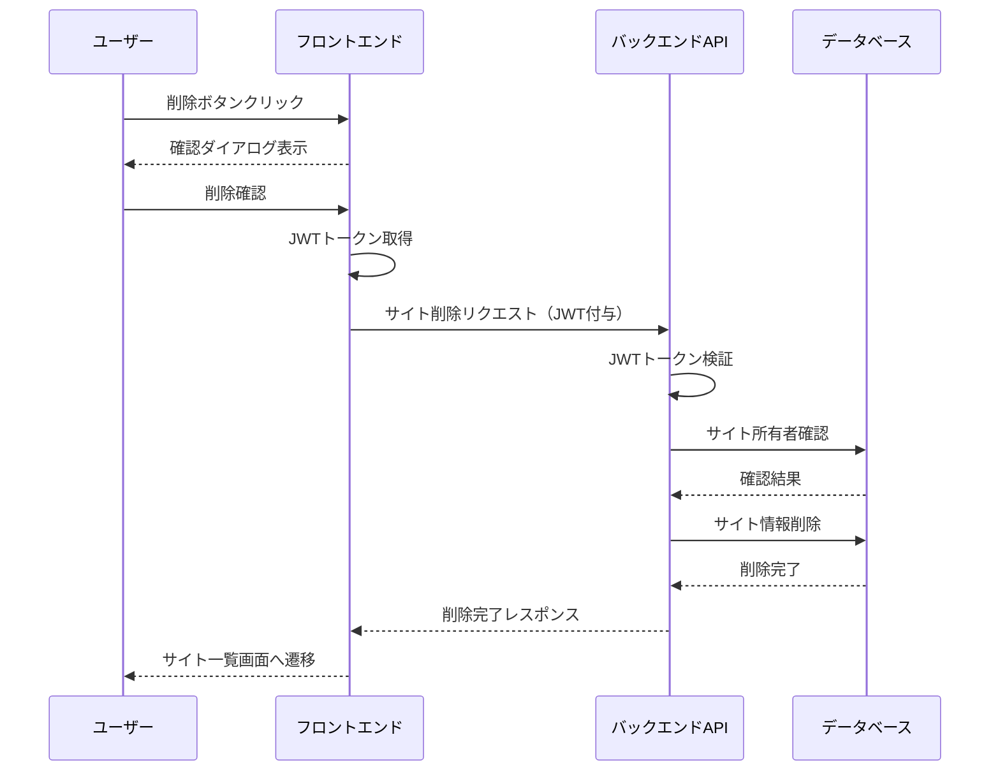
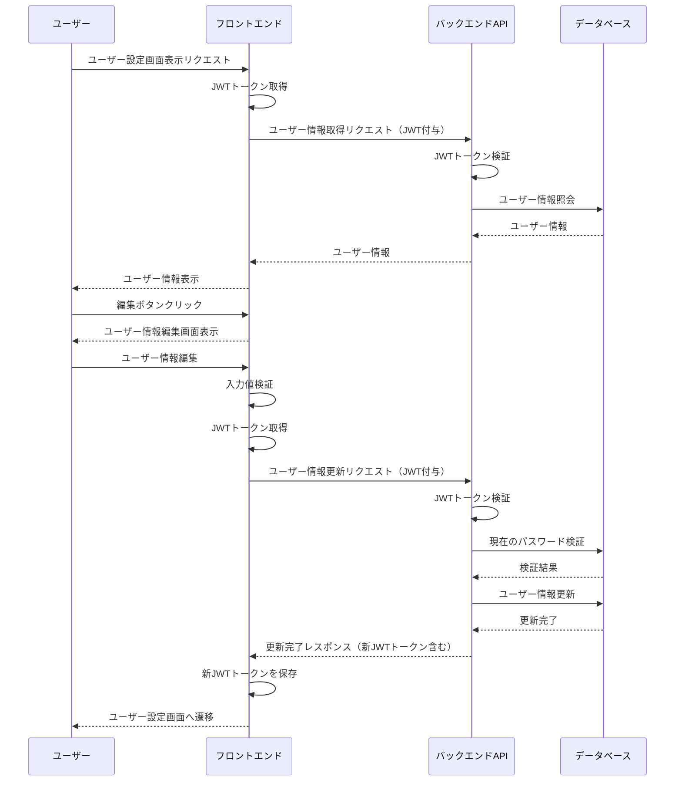

# 機能仕様

## 機能一覧

| 機能名              | 対象ユーザー | 概要                               |
| ------------------- | ------------ | ---------------------------------- |
| ユーザー登録        | admin        | システムへの新規ユーザー登録機能   |
| ログイン/ログアウト | 全ユーザー   | 認証機能                           |
| パスワード再設定    | 全ユーザー   | パスワード再設定機能               |
| サイト登録          | 全ユーザー   | サイトを登録し、公開する機能       |
| サイト編集          | 全ユーザー   | 登録したサイトを編集、削除する機能 |
| ユーザー設定        | 全ユーザー   | ユーザー情報の設定、編集機能       |

## 機能詳細

### ユーザー登録

#### 機能概要

管理者がシステムにアカウントを作成する機能

#### 画面遷移

1. ログインする
2. サイドバーの「管理者画面」をクリック
3. 管理者画面に遷移
4. 必要情報を入力し「登録」ボタンをクリック
5. 登録完了モーダル

#### 入力項目

| 項目名             | 必須 | 型・制約                | バリデーション     | 説明                                |
| ------------------ | ---- | ----------------------- | ------------------ | ----------------------------------- |
| メールアドレス     | ○    | 文字列（最大 255 文字） | メールアドレス形式 | ログイン ID、および連絡先として使用 |
| パスワード         | ○    | 文字列（8〜32 文字）    | 英数字記号混在     | アカウント認証用                    |
| パスワード（確認） | ○    | 文字列（8〜32 文字）    | パスワードと一致   | 確認用                              |
| 役割               | ○    | 選択肢                  | -                  | ユーザーの権限を設定                |

#### 処理フロー

### ログイン/ログアウト

#### 機能概要

JWT（JSON Web Token）を使用したシステムへのログイン・ログアウト機能

#### 画面遷移（ログイン）

1. ログイン画面にアクセス
2. メールアドレスとパスワードを入力
3. 「ログイン」ボタンをクリック
4. 認証成功後、トップページに遷移

#### 画面遷移（ログアウト）

1. サイドバーの「ログアウト」をクリック
2. ログアウト処理後、ログイン画面に遷移

#### 入力項目（ログイン）

| 項目名         | 必須 | 型・制約                | バリデーション     | 説明                                |
| -------------- | ---- | ----------------------- | ------------------ | ----------------------------------- |
| メールアドレス | ○    | 文字列（最大 255 文字） | メールアドレス形式 | ログイン ID、および連絡先として使用 |
| パスワード     | ○    | 文字列（8〜32 文字）    | -                  | アカウント認証用                    |

#### 処理フロー（ログイン）

#### 処理フロー（ログアウト）

### パスワード再設定

#### 機能概要

パスワードを忘れた場合のリセット機能

#### 画面遷移

1. ログイン画面の「パスワードを忘れた場合」リンクをクリック
2. パスワード忘れた画面に遷移
3. メールアドレスを入力し「送信」ボタンをクリック
4. メール送信完了メッセージ表示
5. メールに記載されたリンクをクリック
6. パスワード再設定画面に遷移
7. 新しいパスワードを入力し「送信」ボタンをクリック
8. パスワードリセット完了メッセージ表示

#### 入力項目（パスワード忘れた画面）

| 項目名         | 必須 | 型・制約                | バリデーション     | 説明                   |
| -------------- | ---- | ----------------------- | ------------------ | ---------------------- |
| メールアドレス | ○    | 文字列（最大 255 文字） | メールアドレス形式 | 登録済みメールアドレス |

#### 入力項目（パスワード再設定画面）

| 項目名             | 必須 | 型・制約             | バリデーション   | 説明             |
| ------------------ | ---- | -------------------- | ---------------- | ---------------- |
| パスワード         | ○    | 文字列（8〜32 文字） | 英数字記号混在   | 新しいパスワード |
| パスワード（確認） | ○    | 文字列（8〜32 文字） | パスワードと一致 | 確認用           |

#### 処理フロー

### サイト登録

#### 機能概要

新しいサイトを登録し、公開する機能

#### 画面遷移

1. サイドバーの「新規サイト作成」をクリック
2. 新規サイト作成画面に遷移
3. 必要情報を入力し「公開する」ボタンをクリック
4. サイト編集画面に遷移

#### 入力項目

| 項目名       | 必須 | 型・制約                | バリデーション     | 説明                         |
| ------------ | ---- | ----------------------- | ------------------ | ---------------------------- |
| サイト名     | ○    | 文字列（最大 100 文字） | -                  | サイトの名称                 |
| サイトの説明 | ×    | 文字列（最大 500 文字） | -                  | サイトの説明                 |
| サブドメイン | ○    | 文字列（3〜63 文字）    | 英数字ハイフンのみ | 公開するサイトのサブドメイン |
| HTML         | ○    | テキスト                | -                  | サイトの HTML コード         |
| CSS          | ×    | テキスト                | -                  | サイトの CSS コード          |
| JavaScript   | ×    | テキスト                | -                  | サイトの JavaScript コード   |

#### 処理フロー

### サイト編集

#### 機能概要

登録済みのサイトを編集・削除する機能

#### 画面遷移

1. サイドバーの「作成したサイト」をクリック
2. サイト一覧画面に遷移
3. 編集したいサイトの「編集」ボタンをクリック
4. サイト編集画面に遷移
5. 情報を編集し「更新する」ボタンをクリック、または「削除する」ボタンをクリック

#### 入力項目

| 項目名       | 必須 | 型・制約                | バリデーション     | 説明                         |
| ------------ | ---- | ----------------------- | ------------------ | ---------------------------- |
| サイト名     | ○    | 文字列（最大 100 文字） | -                  | サイトの名称                 |
| サイトの説明 | ×    | 文字列（最大 500 文字） | -                  | サイトの説明                 |
| サブドメイン | ○    | 文字列（3〜63 文字）    | 英数字ハイフンのみ | 公開するサイトのサブドメイン |
| HTML         | ○    | テキスト                | -                  | サイトの HTML コード         |
| CSS          | ×    | テキスト                | -                  | サイトの CSS コード          |
| JavaScript   | ×    | テキスト                | -                  | サイトの JavaScript コード   |

#### 処理フロー（更新）

#### 処理フロー（削除）

### ユーザー設定

#### 機能概要

ユーザー情報の表示・編集機能

#### 画面遷移

1. サイドバーの「ユーザー設定」をクリック
2. ユーザー設定画面に遷移
3. 「編集」ボタンをクリック
4. ユーザー情報編集画面に遷移
5. 情報を編集し「更新する」ボタンをクリック

#### 入力項目（ユーザー情報編集画面）

| 項目名                   | 必須 | 型・制約                | バリデーション     | 説明                           |
| ------------------------ | ---- | ----------------------- | ------------------ | ------------------------------ |
| ユーザー名               | ○    | 文字列（最大 50 文字）  | -                  | 表示名として使用               |
| メールアドレス           | ○    | 文字列（最大 255 文字） | メールアドレス形式 | ログイン ID、連絡先として使用  |
| 現在のパスワード         | ○    | 文字列（8〜32 文字）    | -                  | 変更確認用                     |
| 新しいパスワード         | ×    | 文字列（8〜32 文字）    | 英数字記号混在     | 新しいパスワード（変更時のみ） |
| 新しいパスワード（確認） | ×    | 文字列（8〜32 文字）    | パスワードと一致   | 確認用（変更時のみ）           |

#### 処理フロー

