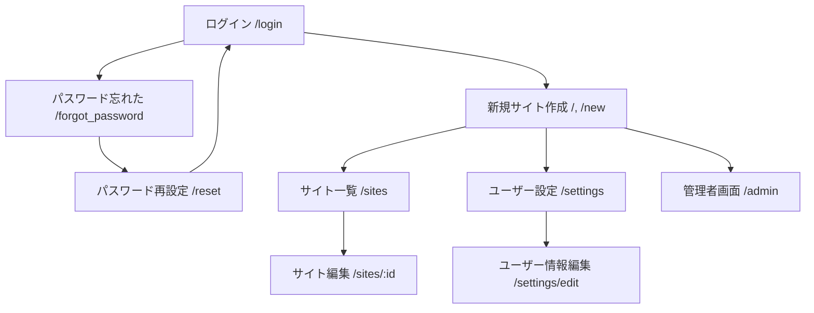

# フロントエンド設計

## 画面構成

### 画面一覧

| 画面名           | URL              | 説明                       | 認証要否 |
| ---------------- | ---------------- | -------------------------- | -------- |
| ログイン         | /login           | ログイン画面               | 不要     |
| パスワード忘れた | /forgot_password | パスワードを忘れた際の画面 | 不要     |
| パスワード再設定 | /reset           | パスワード再設定画面       | 不要     |
| 新規サイト作成   | /, /new          | 新規サイト作成画面         | 必要     |
| サイト一覧       | /sites           | 作成したサイト一覧画面     | 必要     |
| サイト編集       | /sites/:id       | サイト編集画面             | 必要     |
| ユーザー設定     | /settings        | ユーザー設定画面           | 必要     |
| ユーザー情報編集 | /settings/edit   | ユーザー情報編集画面       | 必要     |
| 管理者画面       | /admin           | 管理者画面                 | 必要     |

### 画面遷移図

## ディレクトリ構成

あとで

## コンポーネント設計

あとで

## 詳細画面設計

### quickpub.com/

#### /login(ログイン画面)

- メールとパスワードの入力フォーム
- ログインボタン
- パスワードを忘れた場合のリンク(/forgot_password)

#### /forgot_password(パスワードを忘れた画面)

- メールの入力フォーム
- 送信ボタン
- 送信後: 「メールを送信しました」メッセージ表示
- ログイン画面へ戻るリンク(/login)

#### /reset(パスワード再設定画面)

- 新しいパスワード入力フォーム
- パスワード確認用入力フォーム
- 送信ボタン
- 送信後：「パスワードをリセットしました」メッセージ表示
- ログイン画面へのリンク (/login)

#### 認証必要画面

##### 共通サイドバー

以下の要素を含むサイドバーがすべての認証済み画面に表示される

- ロゴ「quickpub」
- メニュー項目:
  - 新規サイト作成(/new)
  - 作成したサイト(/sites)
    - サイト名のリスト(サイトがある場合)
  - 管理者画面(/admin)※管理者ユーザーのみ表示
  - ユーザー設定
  - ログアウト

##### /、/new(新規サイト作成画面)

- サイト情報入力フォーム：
  - サイト名
  - サイトの説明
  - サブドメイン
  - HTML 編集エリア
  - CSS 編集エリア
  - JavaScript 編集エリア
- 公開するボタン(/sites/:id に遷移)

##### /sites(サイト一覧画面)

- 作成したサイトのリスト表示
  - サイト名
  - サブドメイン
  - 作成日/更新日
  - 編集ボタン（/sites/:id へのリンク）

##### /sites/:id

- サイト情報編集フォーム：
  - サイト名
  - サイトの説明
  - サブドメイン
  - HTML 編集エリア
  - CSS 編集エリア
  - JavaScript 編集エリア
- 更新するボタン
- 削除するボタン(確認ダイアログ表示)

##### /settings(ユーザー設定画面)

- ユーザー情報表示
  - ユーザー名
  - メールアドレス
- 編集ボタン(/settings/edit へのリンク)

##### /settings/edit(ユーザー情報編集画面)

- ユーザー情報編集フォーム
  - ユーザー名
  - メールアドレス
  - 現在のパスワード（変更時に必要）
  - 新しいパスワード（任意）
  - 新しいパスワード確認（任意）
- 更新するボタン

##### /admin(管理者画面)

- ユーザーリスト
- 新規ユーザー作成フォーム
  - メールアドレス入力
  - パスワード入力
  - 役割選択
  - 作成するボタン
