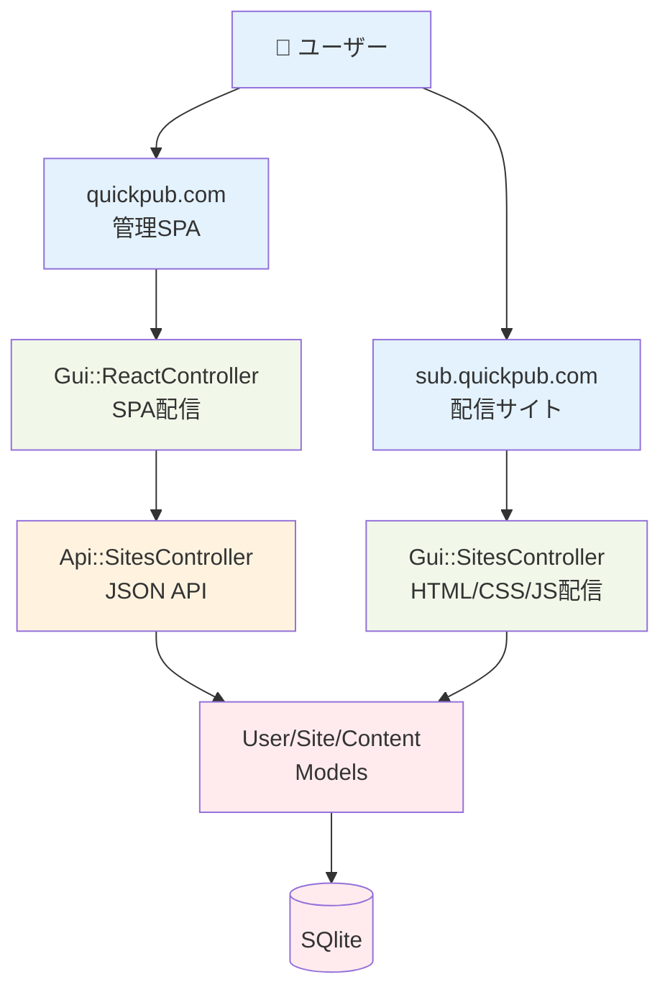

# アーキテクチャ

## 参考

https://claude.ai/chat/3349985a-2004-4ff8-bca3-498571ccc1a1

## 全体構成

```mermaid

graph TB
    %% ユーザーアクセス
    USER[👤 ユーザー] --> MAIN[quickpub.com<br/>管理SPA]
    USER --> SUB[sub.quickpub.com<br/>配信サイト]

    %% コントローラー分離
    MAIN --> REACT[Gui::ReactController<br/>SPA配信]
    SUB --> SITES[Gui::SitesController<br/>HTML/CSS/JS配信]
    REACT --> API[Api::SitesController<br/>JSON API]

    %% データ層
    API --> MODELS[User/Site/Content<br/>Models]
    SITES --> MODELS
    MODELS --> DB[(SQlite)]

    classDef access fill:#e3f2fd
    classDef gui fill:#f1f8e9
    classDef api fill:#fff3e0
    classDef data fill:#ffebee

    class USER,MAIN,SUB access
    class REACT,SITES gui
    class API api
    class MODELS,DB data
```
