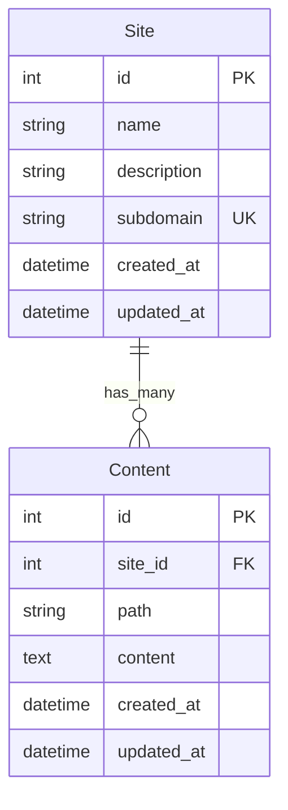

# モデル（User認証なし暫定版）

## モデル定義

### Site

| カラム名    | 型      | 制約 | 説明         |
| ----------- | ------- | ---- | ------------ |
| id          | integer | PK   | ID           |
| name        | string  |      | サイト名     |
| description | string  |      | サイトの説明 |
| subdomain   | string  | UK   | サブドメイン |
| created_at  | datetime |      | 作成日時     |
| updated_at  | datetime |      | 更新日時     |

### Content

| カラム名   | 型      | 制約 | 説明           |
| ---------- | ------- | ---- | -------------- |
| id         | integer | PK   | ID             |
| site_id    | integer | FK   | サイト ID      |
| path       | string  |      | ファイル名     |
| content    | text    |      | ファイルの中身 |
| created_at | datetime |      | 作成日時       |
| updated_at | datetime |      | 更新日時       |

## ER 図

## 注意点

- User認証は後から追加予定
- Siteモデルからuser_idを削除した暫定版
- subdomainはユニーク制約を設定
- ContentはHTMLファイルの管理を想定